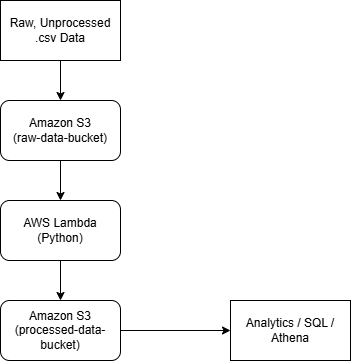

# AWS Serverless ETL

## Project Overview
This project demonstrates a serverless ETL (Extract, Transform, Load) data pipeline built using AWS services. 
Raw CSV sales data is stored in Amazon S3, processed using AWS Lambda (Python), and output as aggregated summary data back into S3 for analytics use.

## Architecture
S3 (Raw Data) → AWS Lambda (Raw Data Transformation) → S3 (Processed Data)

## Technologies Used
- AWS Lambda
- Amazon S3
- Python
- IAM Roles & Policies
- CloudWatch Logs

## ETL Process
1. Upload raw CSV data to S3 raw bucket
2. Lambda function reads raw data
3. Data is transformed and aggregated by region
4. Processed summary file is written to processed S3 bucket

## Example Output
region, quantity,total_sales
East, 5, 250  
West, 4, 200  
South, 3, 175  
North, 3, 125  

## Future Improvements
- Automate pipeline using S3 event triggers
- Query processed data using Amazon Athena
- Visualize data using QuickSight
- More rows of data
